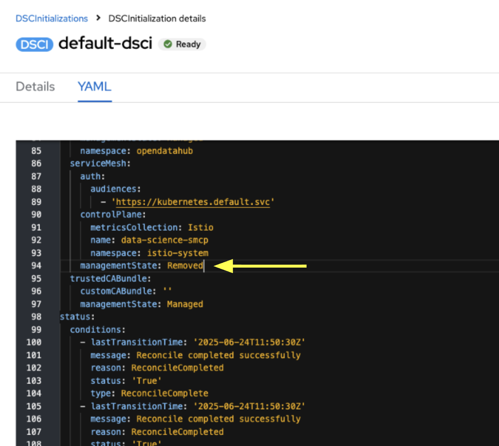
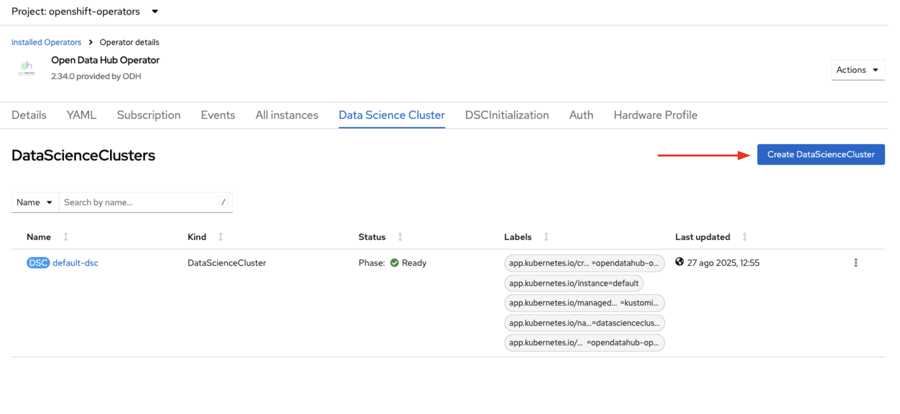

# Notes

A list of notes that need to be formalized into documentation

## Install Infra Prereqs

- OpenShift 4.19 - dependencies needed for `llm-d` are shipped in OCP 4.19

## Configure RHOAI to Disable Knative Serving

RHOAI 2.x leverages Knative Serving by default. The following configurations disable Knative.

### `DSCInitialization`

- Set the `serviceMesh.managementState` to removed, as shown in the following example (this requires an admin role):

```yaml
serviceMesh:
    ...
    managementState: Removed
```

- You can do this through the RHOAI UI as shown below:

<details>
<summary>Click to expand</summary>

</details>

### `DSC`

- Create a data science cluster (`DSC`) with the following information set in `kserve` and `serving`:

```yaml
spec:
  components:
    kserve:
      defaultDeploymentMode: RawDeployment
      managementState: Managed
      ...
      serving:
          ...
          managementState: Removed
          ...
```

- You can create the `DSC` through the RHOAI UI as shown below, using the `dsc.yaml` provided in this repo:

<details>
<summary>Click to expand</summary>

</details>

## Deploy A Gateway

`llm-d` leverages [Gateway API Inference Extension](https://gateway-api-inference-extension.sigs.k8s.io/).

As described in [Getting Started with Gateway API for the Ingress Operator](https://docs.okd.io/latest/networking/ingress_load_balancing/configuring_ingress_cluster_traffic/ingress-gateway-api.html#nw-ingress-gateway-api-enable_ingress-gateway-api), we can can deploy a `GatewayClass` and `Gateway` named
named `openshift-ai-inference` in the `openshift-ingress` namespace:

```bash
oc apply -f gateway.yaml
```

We can see the Gateway is deployed:

```bash
oc get gateways -n openshift-ingress

>> NAME                     CLASS   ADDRESS                                                            PROGRAMMED   AGE
>> openshift-ai-inference   istio   openshift-ai-inference-istio.openshift-ingress.svc.cluster.local   True         9d
```

NOTICE!! - Nothing works beyond this point!

```sh
# Maybe this is missing?
# https://kserve.github.io/website/docs/admin-guide/gatewayapi-migration#4-configure-kserve-to-use-gateway-api
```

## Deploy An LLMService with `llm-d`

With the gateway deployed, we can now deploy an `LLMInferenceService` using KServe, which creates an inference pool of vLLM servers and an end-point-picker (EPP) for smart scheduling across the vLLM servers.

The `deployment.yaml` contains a sample manifest for deploying:

```bash
oc create ns demo-llm
oc apply -f deployment.yaml -n demo-llm
```

- We can see the `llminferenceservice` is deployed ...

```bash
oc get llminferenceservice -n demo-llm

>> NAME   URL   READY   REASON   AGE
>> qwen         True             9m44s
```

- ... and that the `router-scheduler` and `vllm` pods are ready to go:

```bash
oc get pods -n demo-llm

>> NAME                                            READY   STATUS    RESTARTS   AGE
>> qwen-kserve-c59dbf75-5ztf2                      1/1     Running   0          9m15s
>> qwen-kserve-c59dbf75-dlfj6                      1/1     Running   0          9m15s
>> qwen-kserve-router-scheduler-67dbbfb947-hn7ln   1/1     Running   0          9m15s
```

Send an HTTP request with the OpenAI API:

```sh
INFERENCE_URL=$(
  oc -n openshift-ingress get gateway openshift-ai-inference \
    -o jsonpath='{.status.addresses[0].value}'
)

LLM=openai/gpt-oss-20b
LLM_SVC=${LLM##*/}

PROMPT="Explain the difference between supervised and unsupervised learning in machine learning. Include examples of algorithms used in each type."

llm_post_data(){
cat <<JSON
{
  "model": "${LLM}",
  "prompt": "${PROMPT}",
  "max_tokens": 200,
  "temperature": 0.7,
  "top_p": 0.9
}
JSON
}

curl -s -X POST http://${INFERENCE_URL}/demo-llm/${LLM_SVC}/v1/completions \
  -H "Content-Type: application/json" \
  -d "$(llm_post_data)" | jq .choices[0].text
```

## Cleanup

```bash
oc delete llminferenceservice qwen -n demo-llm
```

## Issues

- The namespace `opendatahub` is installed

## TODO

- [ ] Verify that gateway works on bare metal cluster
- [ ] Create configuration for [GPT-OSS-20B](https://huggingface.co/openai/gpt-oss-20b)
